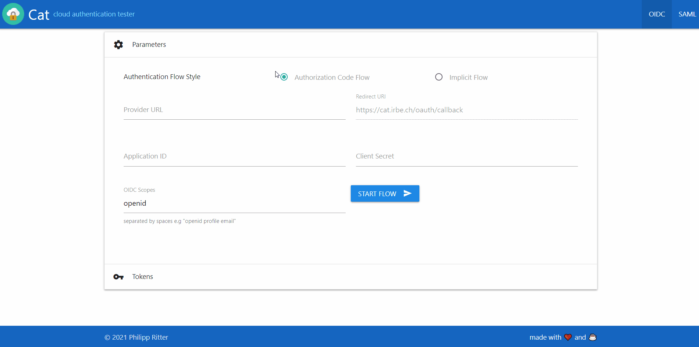

[](https://goreportcard.com/report/github.com/pheelee/Cat)
[](https://codecov.io/github/pheelee/cat)

# Cat - cloud authentication tester
This little web project provides service providers to test OIDC and SAML authentication.

I wrote it to test ADFS Claim transformation rules but it can be used for other scenarios too.

## Run
```bash
docker build -t pheelee/cat
docker run -e COOKIE_SECRET=yourVerySecureString123 -p 8090:8090 pheelee/cat
```

### Arguments

`-CookieSecret` specify a random string used to secure the cookies
```
./Cat --CookieSecret yourVerySecureString123
```

`-StaticDir` specify the path to the static assets (mainly used for development)
```
./Cat --StaticDir /app/assets
```

## In Action
Live Demo is hosted at https://cat.irbe.ch

### OIDC Demo


### SAML Demo

